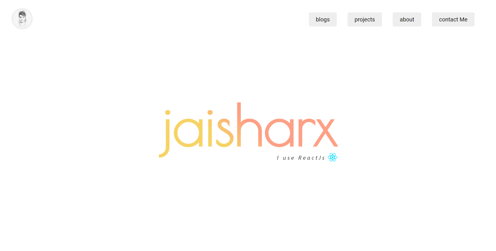

# jaisharx.dev | my onespot website for everything


## Getting started

I've build this using the latest and greatest [Nextjs]() framework of react.
It really helps you with pain point of building an app with react.

You can close and run the website locally:
```bash
npm run dev
# or
yarn dev
```

Then open [http://localhost:3000](http://localhost:3000) in your browser to see the result.

## Learn More

To learn more about Next.js, take a look at the following resources:

- [Next.js Documentation](https://nextjs.org/docs) - learn about Next.js features and API.
- [Learn Next.js](https://nextjs.org/learn) - an interactive Next.js tutorial.

## Deploy on Vercel

This website is deployed on [Vercel](https://vercel.com/import?utm_medium=default-template&filter=next.js&utm_source=create-next-app&utm_campaign=create-next-app-readme), the hosting platform from the very creators of Next.js.

Check out our their [docs](https://nextjs.org/docs/deployment) for more details.
